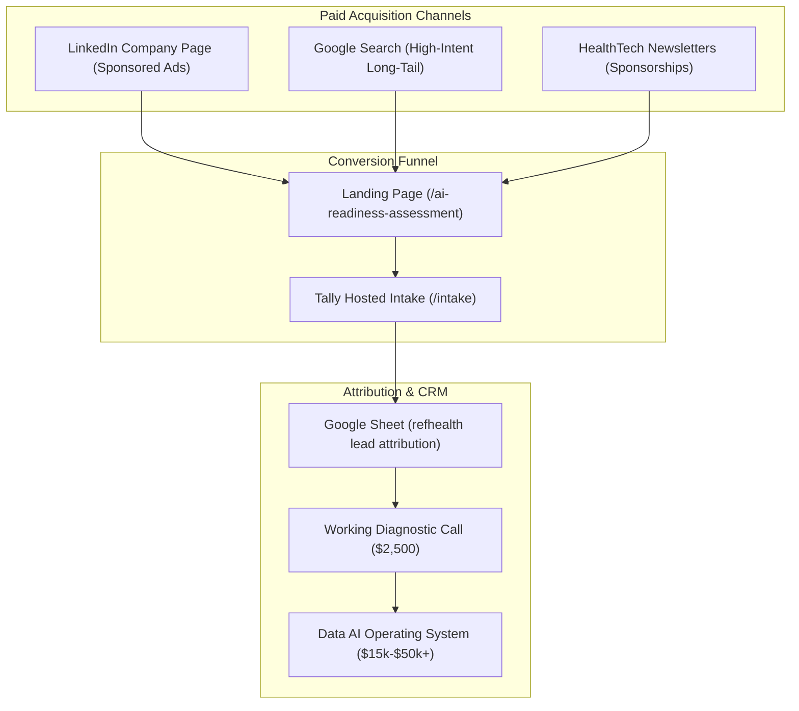
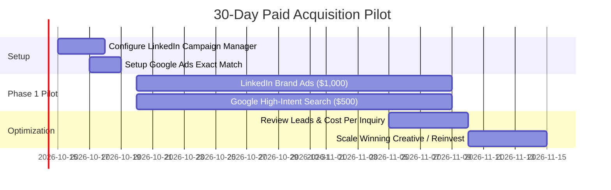

# ref(health) Consulting — Paid Acquisition & Advertising Plan

**Objective**: Acquire qualified commercial inquiries for the **$2,500 AI-Readiness Diagnostic** from Seed-to-Series B health-tech startups, creating an inbound pipeline for full Data AI Operating System buildouts ($15k–$50k+).

**Brand & Privacy Policy**:
All advertising is conducted strictly under the **ref(health) Consulting** brand and company page. No campaigns or sponsored content will run through the founder's personal LinkedIn profile, ensuring complete separation from personal accounts and day-job activities.

---

## 1. Unit Economics & Breakeven Model

B2B healthcare consulting advertising functions as a client acquisition engine for a high-margin service funnel. The $2,500 diagnostic is a paid evaluation wedge that qualifies clients for major follow-on advisory contracts.

| Metric | Target Assumption | Rationale |
| :--- | :--- | :--- |
| **Diagnostic Starting Price** | **$2,500** | Low-friction commercial entry point |
| **Target Cost Per Click (CPC)** | **$12 – $18** | Premium B2B audience (LinkedIn / Google Search) |
| **Landing Page Conversion Rate** | **3.0% – 5.0%** | Dedicated landing page with transparent scope & pricing |
| **Cost Per Lead (CPL)** | **$250 – $400** | Cost per completed Tally intake submission |
| **Lead-to-Close Rate** | **25% – 33%** | Qualified intent, pre-scoped price, direct technical review |
| **Diagnostic CAC** | **$1,000 – $1,500** | Profitable on the diagnostic alone |
| **Follow-on Conversion Rate** | **30% – 40%** | Diagnostics converting to Data AI OS builds ($15k–$50k) |
| **Blended Customer LTV** | **$10,000 – $25,000+** | **LTV : CAC ratio > 8:1** |

> [!NOTE]
> **Front-End Breakeven**: Closing just 1 diagnostic for every $2,500 in ad spend makes the paid acquisition 100% self-funding while generating qualified enterprise pipeline.

---

## 2. Channel Architecture

### Channel 1: LinkedIn Sponsored Content (65% of budget — $1,000)
* **Identity**: Run exclusively via the **ref(health) Consulting** LinkedIn Company Page.
* **Target Audience Filters**:
  * **Job Titles**: CTO, Head of Data, VP of Engineering, Chief Medical Officer, Founder, Co-Founder, Head of Product.
  * **Industries**: Digital Health, Healthcare Technology, Biotechnology, Hospital & Health Care.
  * **Company Headcount**: 11–50 employees, 51–200 employees (Seed to Series B funded teams).
  * **Geography**: United States.
* **Ad Formats**:
  * **Document Carousels (PDF Slides)**: Slide deck visual breaking down *"The Healthcare Data AI Architecture Checklist"* or *"Why Healthcare AI Pilots Stall at the Data Layer"*. Document ads drive higher click-through and dwell time for senior technical buyers.
  * **Single Image Ads**: Clean diagrammatic visual contrasting un-governed AI prototypes with a governed Company Data AI Operating System.

### Channel 2: Google Search — High-Intent Phrase Match (25% of budget — $500)
* **Goal**: Capture buyers actively seeking specialized healthcare data and AI architecture consulting.
* **Target Keywords (Exact & Phrase Match)**:
  * `"healthcare data consulting"`
  * `"dbt healthcare data model"`
  * `"healthcare ai readiness"`
  * `"healthcare analytics engineering consulting"`
  * `"hipaa compliant ai architecture"`
* **Negative Keywords**:
  * `jobs`, `salary`, `careers`, `internship`, `free`, `course`, `certification`, `medical coding`, `reddit`, `pdf`, `degree`.

### Channel 3: Niche Health-Tech Community Sponsorships (10% of budget / opportunistic)
* **Goal**: High-credibility awareness among digital health operators.
* **Targets**:
  * **Health Tech Nerds (HTN)**: Community service board / newsletter sponsor.
  * **Out-Of-Pocket (Nikhil Krishnan)**: Dedicated healthcare newsletter reads.

---

## 3. Creative Concepts & Ad Copy

### Concept A: "The AI Readiness Trap" (Problem-Aware)
* **Headline**: Don't build LLM agents on broken healthcare schemas.
* **Body Copy**:
  > 85% of healthcare AI initiatives stall before reaching production—not because the models failed, but because the underlying clinical and claims data lacks governance, testing, and semantic consistency.
  >
  > ref(health) Consulting delivers the **AI-Readiness Diagnostic**: a 2-week, fixed-scope architecture evaluation designed for health-tech startups.
  >
  > We inspect your models, data pipelines (dbt), and security boundaries before you fund the wrong build.
* **CTA Button**: Request a Diagnostic ($2,500)
* **Destination URL**:
  `https://refhealth.consulting/ai-readiness-assessment.html?utm_source=linkedin&utm_medium=paid_social&utm_campaign=ai_readiness&utm_content=broken_schemas`

---

### Concept B: "Senior Judgment vs. Agency Retainers" (Solution-Aware)
* **Headline**: Senior healthcare data & AI leadership. Without a 6-month agency retainer.
* **Body Copy**:
  > Health-tech startups rarely need a 10-person agency team. You need senior judgment that connects 21 years of payer/provider operating discipline with dbt analytics engineering and practical AI delivery.
  >
  > Start with our focused diagnostic starting at $2,500. We rank what to build, what to kill, and how to govern your Data AI Operating System.
* **CTA Button**: Scope Your Diagnostic
* **Destination URL**:
  `https://refhealth.consulting/intake.html?utm_source=linkedin&utm_medium=paid_social&utm_campaign=senior_judgment&utm_content=no_agency_retainer`

---

### Concept C: "The Data AI Operating System" (Product-Aware)
* **Headline**: Transition from experimental AI notebooks to a governed Data AI Operating System.
* **Body Copy**:
  > Model orchestration across OpenAI, Anthropic, Google, and open-source models is only as reliable as your data lineage.
  >
  > See how ref(health) connects business decisions, dbt data products, and AI workflow agents into a single accountable operating system.
* **CTA Button**: Explore the Operating System
* **Destination URL**:
  `https://refhealth.consulting/healthcare-ai-consulting.html?utm_source=linkedin&utm_medium=paid_social&utm_campaign=data_ai_os&utm_content=operating_system_diagram`

---

## 4. Attribution & Lead Tracking Integration

Your site attribution infrastructure (`analytics.js`) captures paid traffic automatically without third-party tracking pixels or cookie banners:

1. **Ad URL**: Includes standard UTM parameters (`utm_source`, `utm_medium`, `utm_campaign`, `utm_content`).
2. **Attribution Engine (`analytics.js`)**: Captures first-touch and last-touch parameters on initial page load and stores them in browser storage.
3. **Tally Hidden Fields**: When the visitor navigates to `/intake`, `analytics.js` dynamically injects the UTM parameters into Tally's hidden form fields.
4. **Google Sheets Log**: Every completed intake automatically appears in `refhealth lead attribution` with exact campaign attribution.
5. **GA4 & Looker Studio**: Campaign sessions, diagnostic CTA clicks, and form starts appear in your [Looker Studio Dashboard](https://datastudio.google.com/u/0/reporting/5f7d5706-71b8-4121-ba2b-73b29a223af7/page/QHz8F).

---

## 5. Phased Pilot Budget ($1,500 / 30-Day Sprint)

### Initial Spend Breakdown:
* **LinkedIn Sponsored Brand Content**: **$1,000** ($50/day over 20 active weekdays)
  * Expected Clicks: ~60–80 qualified clicks (CTO / Head of Data)
  * Expected Intake Leads: 2–3 inquiries
* **Google High-Intent Search**: **$500** ($25/day over 20 active weekdays)
  * Expected Clicks: ~35–50 high-intent searches
  * Expected Intake Leads: 1–2 inquiries
* **Total Pilot Spend**: **$1,500**
* **Target Pilot Outcome**: 3–5 completed diagnostic inquiries $\rightarrow$ **1 closed diagnostic ($2,500)**.
* **Financial Result**: **+$1,000 net profit** on the pilot + pipeline for $15k–$50k follow-on builds.

---

## 6. Launch Checklist

- [ ] Create/access **LinkedIn Campaign Manager** under the `refhealth.consulting` organization account.
- [ ] Upload brand creative assets (1200x628 single image or 1080x1080 carousel slides) showcasing the Data AI OS concept.
- [ ] Configure target audience: US + Healthtech/Digital Health + 11–200 employees + Technical C-suite/Heads.
- [ ] Set up **Google Ads** campaign targeting 5–8 exact/phrase match healthcare data keywords with strict negative keyword list.
- [ ] Verify test click passes UTMs through to the `refhealth lead attribution` Google Sheet.
- [ ] Review intake inquiries weekly in the [Looker Studio Dashboard](https://datastudio.google.com/u/0/reporting/5f7d5706-71b8-4121-ba2b-73b29a223af7/page/QHz8F).
