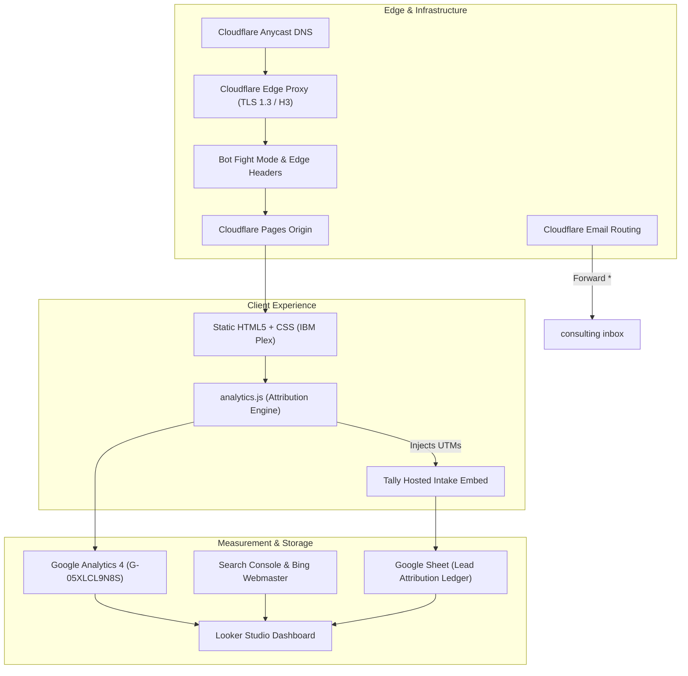
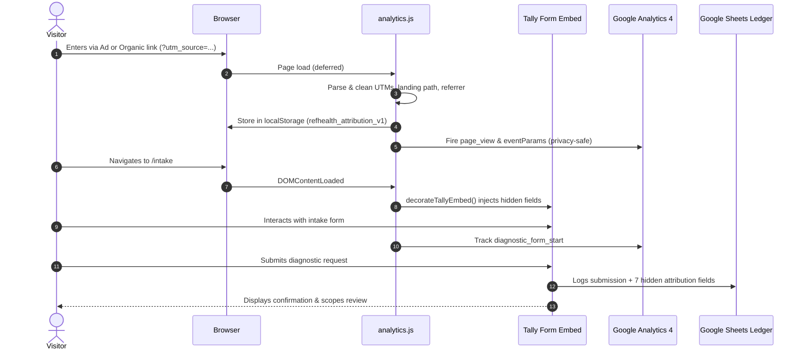

# ARCHITECTURE — refhealth.consulting

## System Overview

`refhealth.consulting` is a high-performance, privacy-compliant static web application and commercial conversion engine for healthcare data, analytics engineering (dbt), and practical AI consulting.

The system is designed for zero runtime maintenance, maximum edge speed (<50ms TTFB globally), resilient security boundaries, and automated attribution without third-party tracking cookies or client-side bloat.

---

## Component Architecture

### Free readiness checker and local MCP

`readiness-checker.html` is a static, browser-only interface. `readiness-ui.mjs`
reads an optional local dbt `manifest.json` with the File API (10 MB limit) and
renders findings with DOM text nodes. It never posts manifest contents. The
bundled sample and `evaluateManifest` rules live in `readiness-core.mjs`.

`mcp/server.mjs` imports the same core and exposes `list_dbt_models` and
`review_dbt_model` over local stdio using the official MCP TypeScript SDK. It
reads a named local manifest, returns structured findings, and makes no network
calls. `readiness-mcp.zip` contains the server, shared core, lockfile, sample,
and setup instructions for public download. It is checked against source files
in `.github/workflows/checks.yml`.

The rules inspect declared documentation, owner, tests, upstream sources and seeds, and
freshness configuration. Privacy, access, human review, and business value are
explicit unknowns. The output is a conversation starter, not a certification.
GA4 receives only `checker_report_view` with a sample/local-file flag and
`mcp_download_click`; neither event includes model names, file names, paths,
descriptions, or use-case text.

### 1. Edge & Hosting Layer (Cloudflare)
* **Domain Registrar**: Cloudflare Registrar (migrated from Namecheap on 2026-09-20). Operates at wholesale at-cost renewal with registry transfer lock enabled (`clientTransferProhibited`).
* **Authoritative DNS**: Cloudflare Anycast nameservers (`barbara.ns.cloudflare.com`, `damien.ns.cloudflare.com`) with CNAME flattening at apex.
* **Edge CDN & Network**:
  * Full TLS 1.3 encryption with Google Trust Services origin certificates.
  * HTTP/2 and HTTP/3 (QUIC) enabled globally.
  * **Always Use HTTPS**: Native edge rule enforcing 301 redirection from HTTP to HTTPS.
  * **Bot Fight Mode**: Actively challenges automated scrapers and cloud IP crawler sweeps before they reach origin.
* **Hosting Origin**: Cloudflare Pages (`refhealth-consulting` project) serving custom domains `refhealth.consulting` and `www.refhealth.consulting`.
  * **Pretty URLs**: Native 308 redirection from legacy `.html` endpoints to clean URL paths.
  * **404 Routing**: Native fallback to `404.html` with `HTTP/2 404 Not Found` response code, eliminating soft 404s.
* **Edge Headers (`_headers`)**:
  * `Strict-Transport-Security: max-age=31536000; includeSubDomains; preload` (HSTS).
  * `X-Frame-Options: SAMEORIGIN` (prevents clickjacking).
  * `X-Content-Type-Options: nosniff`.
  * `Referrer-Policy: strict-origin-when-cross-origin`.
  * `Permissions-Policy: accelerometer=(), camera=(), geolocation=(), microphone=(), payment=(), usb=()`.
  * Granular caching: `public, max-age=0, must-revalidate` for HTML; `public, max-age=31536000, immutable` for static CSS/SVG/PNG assets.
* **Email Routing**:
  * Catch-all route (`*@refhealth.consulting` $\rightarrow$ `refhealth.consulting@gmail.com`).
  * Cloudflare published MX records (`route1-3.mx.cloudflare.net`), SPF (`include:_spf.mx.cloudflare.net`), and DKIM (`cf2024-1._domainkey`).

---

### 2. Frontend & Design System
* **Stack**: Semantic HTML5 and vanilla modern CSS. No JavaScript frameworks, runtime dependencies, or client build bundles.
* **Design System (`DESIGN.md`)**:
  * Aesthetic: "Company Data AI Operating System".
  * Palette: Cool paper (`#edf1ef`), strong paper (`#fbfcf6`), near-black ink (`#11100e`), with signal red (`#d1392d`), signal amber (`#d69a24`), and signal green (`#19795b`) indicating governance and readiness states.
  * The **No Default Healthcare Blue** rule: avoids generic healthcare gradients in favor of operational, senior visual discipline.
  * Typography: `IBM Plex Sans` for executive argument; `IBM Plex Mono` for status markers, numbers, and system layers.
  * Radius: 6px control surfaces with tactile `:active` press states.
* **Brand Assets**: Custom SVG favicon (`favicon.svg`), PWA webmanifest (`site.webmanifest`), and deterministic 1200x630 social preview card (`og.png` / `og-card.svg`).

---

### 3. Attribution & Commercial Conversion Flow

* **Attribution Engine (`analytics.js`)**:
  * Intercepts allow-listed UTM keys (`utm_source`, `utm_medium`, `utm_campaign`, `utm_content`, `utm_term`), the landing path, and referring host.
  * Stores first-touch and last-campaign attribution in `localStorage` (`refhealth_attribution_v1`).
  * Tracks high-intent interactions: `diagnostic_cta_click`, `diagnostic_form_start`, and `contact_email_click`.
* **Hosted Intake (`intake.html`)**:
  * Hosted via Tally (`https://tally.so/r/5BJOVN`) in a sandboxed iframe.
  * Form automatically inherits hidden attribution fields from `analytics.js`.
  * Plain-text email fallback (`contact@refhealth.consulting`) placed directly above embed.
  * Direct webhook connection pushes completed inquiries into the `refhealth lead attribution` Google Sheet.
* **Operating Dashboard**:
  * Unified Google Looker Studio report combines GA4 active users, Google Search Console query impressions/clicks, and Tally intake counts.

---

### 4. CI/CD & Deployment Pipeline

* **Repository**: GitHub private repository `apratsunrthd/refhealth.consulting`.
* **CI/CD Workflow (`.github/workflows/sitemap.yml`)**:
  1. **Trigger**: Push to branch `main`.
  2. **Sitemap Generation**: Generates `sitemap.xml` via `cicirello/generate-sitemap@v1`.
  3. **Analytics Validation**: Injects GA4 snippet across any newly added pages via `inject-ga.js`.
  4. **Auto-commit**: Commits updated `sitemap.xml` with `[skip ci]`.
  5. **IndexNow Ping**: Sends updated URL array to `https://api.indexnow.org/indexnow` for immediate Bing/Yandex change notifications.
  6. **Edge Deploy**: Deploys workspace directly to Cloudflare Pages via `cloudflare/wrangler-action@v3` using repository secrets `CLOUDFLARE_API_TOKEN` and `CLOUDFLARE_ACCOUNT_ID`.
* **Deployment Policy**: Standing branch $\rightarrow$ commit $\rightarrow$ PR $\rightarrow$ squash-merge $\rightarrow$ deploy workflow. Direct commits to `main` are prohibited.

---

### 5. Key Technical Decisions & Tradeoffs

| Decision | Alternative Considered | Rationale |
| :--- | :--- | :--- |
| **Static HTML/CSS without Framework** | Next.js, Astro, Hugo | Eliminates node runtime vulnerabilities, dependency drift, hydration delays, and server maintenance. Instant build and deploy. |
| **Cloudflare Pages over GitHub Pages** | GitHub Pages, Vercel | Native edge header control (`_headers`), automatic 308 pretty URLs, DDoS mitigation, unmetered edge requests, and co-location with Cloudflare DNS and Registrar. |
| **Tally Iframe with Hidden Fields** | Custom backend API, Formspree | Zero backend code or database to maintain; native webhook to Google Sheets; complies with strict healthcare zero-PHI collection policy. |
| **Edge Bot Fight Mode Challenge** | WAF rate-limiting, CAPTCHAs | Automatically filters automated cloud scraper sweeps (e.g. proxy scans) using lightweight JS challenges without degrading real human UX. |
| **Privacy-Bounded Attribution** | Full session replays (Hotjar, FullStory) | Healthcare consulting requires absolute data hygiene. No keystrokes, personal data, or form inputs are ever captured in analytics. |
